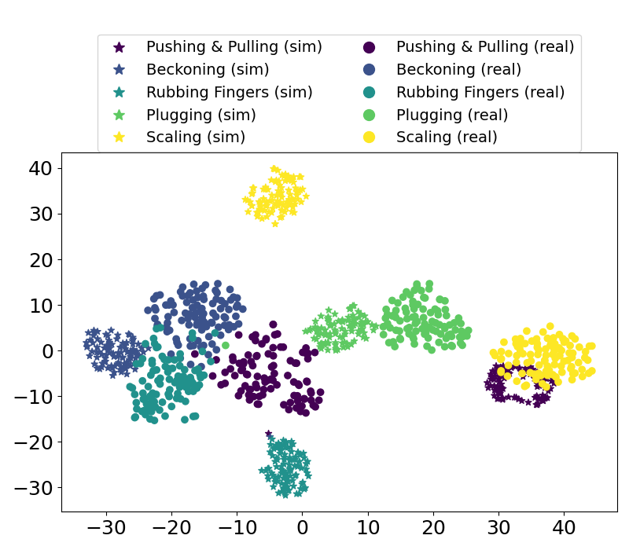

# CASTER_classification

## Source Only + Source mixed target w/ labels

+ Testing accuracies for Schemes 1~6:

+ Confusion charts for Schemes 1~6:

<table align="center">
  <tr align="center">
    <th>Scheme 1</th>
    <th>Scheme 2</th>
    <th>Scheme 3</th>
  </tr>
  <tr align="center">
    <td></td>
    <td></td>
    <td></td>
  </tr>
  <tr align="center">
    <th>Scheme 4</th>
    <th>Scheme 5</th>
    <th>Scheme 6</th>
  </tr>
  <tr align="center">
    <td></td>
    <td></td>
    <td></td>
  </tr>
</table>

## Unsupervised domain adpataion

<table>
<thead>
  <tr align="center">
    <th colspan="2">Source only (<a href="./features.ipynb" alt="tsne">features.ipynb</a>: 83%)</th>
    <th colspan="2">Transferred (<a href="./ADDA_test_new.ipynb" alt="tsne">ADDA_test_new.ipynb</a>: 93%)</th>
  </tr>
</thead>
<tbody>
  <tr align="center">
    <td></td>
    <td></td>
    <td></td>
    <td><</td>
  </tr>
</tbody>
</table>